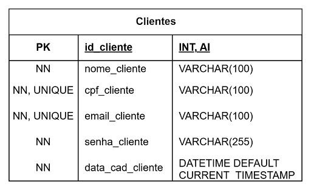
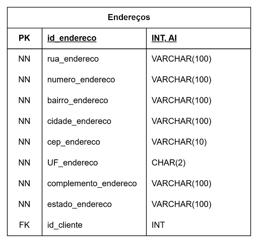
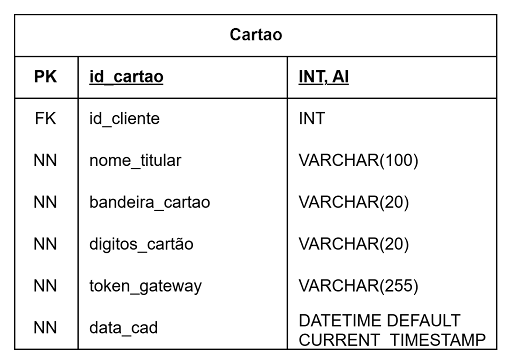
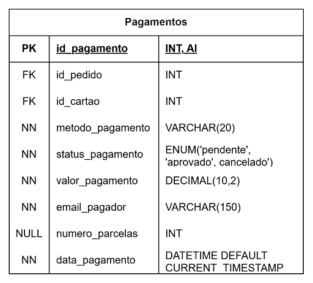
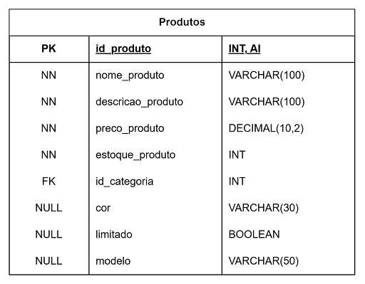

# 🗄️ Modelo de Dados
Este documento representa o modelo de dados do sistema de maneira mais detalhada, focando em especificar seus relacionamentos e descre ver entidades.

## 👤 Entidade: Clientes

### 📌 Descrição
Representa os clientes da loja que estão cadastrados no sistema.

### 🧾 Atributos
- id_cliente (PK);
- nome_cliente;
- cpf_cliente;
- email_cliente;
- senha_cliente;
- data_cad_cliente.

### 🔗 Relacionamentos
- Clientes X Endereços;
- Clientes X Telefones;
- Clientes X Cartao;
- Clientes X Pedidos.

## 📍 Entidade: Enderecos

### 📌 Descrição
Representa o endereço dos clientes cadastrados na loja.

### 🧾 Atributos
- id_endereco (PK);
- rua_endereco;
- numero_endereco;
- bairro_endereco;
- cidade_endereco;
- cep_endereco;
- UF_endereco;
- complemento_endereco;
- id_cliente (FK).

### 🔗 Relacionamentos
- Pagamentos X Pedidos;
- Pagamentos X Cartao;

## 📞 Entidade: Telefones

### 📌 Descrição
Representa o telefone dos clientes cadastrados na loja.

### 🧾 Atributos
- id_telefone (PK);
- numero_telefone;
- id_cliente (FK).

### 🔗 Relacionamentos
- Telefones X Clientes;

## 📝 Entidade: Pedidos

### 📌 Descrição
Representa os pedidos realizados pelos clientes da loja, mais especificamente seus status e data de realização.

### 🧾 Atributos
- id_pedido (PK);
- data_pedido;
- status_pedido;
- id_cliente (FK)

### 🔗 Relacionamentos
- Pedidos X Clientes;
- Pedidos X itens_pedidos.

## 💳 Entidade: Cartao

### 📌 Descrição
Representa os cartões de crédito/débito dos clientes.

### 🧾 Atributos
- id_pedido (PK);
- data_pedido;
- status_pedido;
- id_cliente (FK).

### 🔗 Relacionamentos
- Pedidos X Clientes;
- Pedidos X itens_pedidos.

## 💲 Entidade: Pagamentos

### 📌 Descrição
Representa os pagamentos realizados pelos clientes.

### 🧾 Atributos
- id_pagamento (PK);
- id_pedido (FK);
- id_cartao (FK);
- metodo_pagamento;
- status_pagamento;
- valor_pagamento;
- email_pagador;
- numero_parcelar;
- data_pagamento.

### 🔗 Relacionamentos
- Pedidos X Clientes;
- Pedidos X itens_pedidos.

## 📦 Entidade: itens_pedidos

### 📌 Descrição
Representa os itens pedidos pelo cliente.

### 🧾 Atributos
- id_itens_pedidos (PK);
- id_pedido (FK);
- id_produto (FK);
- quantidade;
- preco_unitario.

### 🔗 Relacionamentos
- itens_pedidos X Produtos;
- itens_pedidos X Pedidos.

## 🛒 Entidade: Produtos

### 📌 Descrição
Representa os produtos disponíveis na loja.

### 🧾 Atributos
- id_produto (PK);
- nome_produto;
- descricao_produto;
- preco_produto;
- estoque_produto;
- id_categoria (FK);
- cor;
- limitado;
- modelo.

### 🔗 Relacionamentos
- Produtos X itens_pedidos;
- Produtos X Categorias.

## 🏷️ Entidade: Categorias

### 📌 Descrição
Representa as possíveis categorias que um produto pode ter na loja.

### 🧾 Atributos
- id_categoria (PK);
- nome_categoria;
- descricao_categoria;

### 🔗 Relacionamentos
- Categorias X Produtos.
